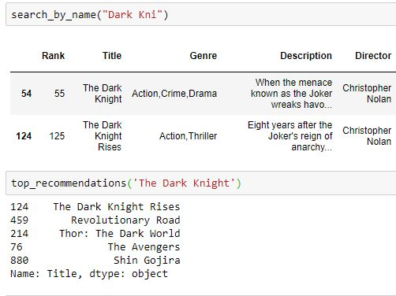

# Description-based-Movie-Recommender

# Overview

The project is a simple Movie recommender that takes in description movie description or plot and then recommends similar movies. 
The code uses simple natural language processing techniques to score the similarity of a movie with other movies and then selects
the top five.

# Dependencies

  numpy
  pandas
  sklearn
  
The dataset used is the IMDB metadata consisting of 1000 movies
  
# Process

In order to minimize the value of the stopwords like "a, the" etc. stop words are removed. The words are then converted into tf-idf 
vectors so that the similarity costs are estimated. 
For the similarity costs consine similarity is computed by taking the dot product of the tfidf vectors. The costs are then sorted 
and top five are selected.

Use the search function to search for a movie and finally type the title in the top_recommendations fuction.

# Result

The results were good considering the small dataset.

As seen in the figure, recommendations for The Dark Knight include the other superhero movies.
